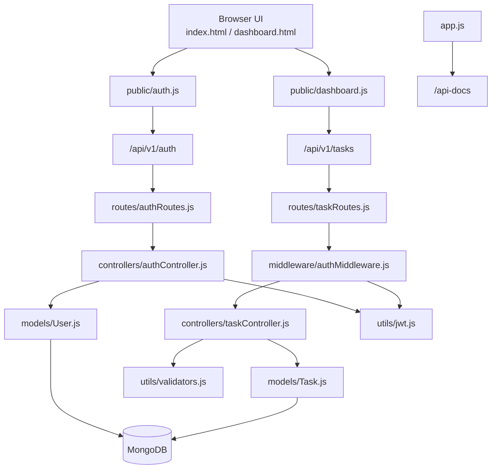
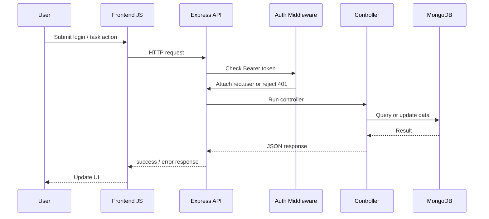

# Internship Task Manager API

A clean full-stack internship project built with Node.js, Express, MongoDB, Mongoose, JWT authentication, Swagger docs, and a simple vanilla JavaScript frontend.

This project includes:
- user registration and login
- JWT-protected routes
- task CRUD
- per-user task ownership enforcement
- basic admin route support
- frontend login + dashboard flow
- Swagger UI for selected API docs

## Tech Stack

- Backend: Node.js, Express
- Database: MongoDB, Mongoose
- Authentication: JWT, bcrypt
- API Docs: swagger-jsdoc, swagger-ui-express
- Frontend: HTML, CSS, Vanilla JavaScript
- Development: nodemon

## Features

- Register a new user
- Login with email and password
- Store JWT in `localStorage`
- Protect task routes with Bearer token auth
- Prevent users from accessing other users' tasks
- Create, view, edit, complete, and delete tasks
- Pagination support for task listing
- Centralized error handling
- Input validation for auth and tasks
- Basic logging middleware
- Basic in-memory rate limiting
- Swagger UI at `/api-docs`

## Project Structure

### Mermaid overview



### Folder map

```mermaid
graph TD
    ROOT[intern/] --> CONFIG[config/]
    ROOT --> CONTROLLERS[controllers/]
    ROOT --> MIDDLEWARE[middleware/]
    ROOT --> MODELS[models/]
    ROOT --> PUBLIC[public/]
    ROOT --> ROUTES[routes/]
    ROOT --> UTILS[utils/]
    ROOT --> POSTMAN[postman/]
    ROOT --> APP[app.js]
    ROOT --> SERVER[server.js]
    ROOT --> ENVEX[.env.example]
    ROOT --> PKG[package.json]
    ROOT --> README[README.md]

    CONFIG --> DB[db.js]
    CONFIG --> ENV[env.js]
    CONFIG --> SWAGGER[swagger.js]

    CONTROLLERS --> AUTHC[authController.js]
    CONTROLLERS --> TASKC[taskController.js]
    CONTROLLERS --> ADMINC[adminController.js]

    MIDDLEWARE --> AUTHM[authMiddleware.js]
    MIDDLEWARE --> ERRM[errorMiddleware.js]
    MIDDLEWARE --> LOGM[loggingMiddleware.js]
    MIDDLEWARE --> NOTFOUND[notFoundMiddleware.js]
    MIDDLEWARE --> RATEM[rateLimitMiddleware.js]
    MIDDLEWARE --> ROLEM[roleMiddleware.js]

    MODELS --> USER[User.js]
    MODELS --> TASK[Task.js]

    PUBLIC --> INDEX[index.html]
    PUBLIC --> AUTHJS[auth.js]
    PUBLIC --> DASHHTML[dashboard.html]
    PUBLIC --> DASHJS[dashboard.js]
    PUBLIC --> CSS[styles.css]

    ROUTES --> ROUTEINDEX[index.js]
    ROUTES --> AUTHR[authRoutes.js]
    ROUTES --> TASKR[taskRoutes.js]
    ROUTES --> ADMINR[adminRoutes.js]

    UTILS --> APPERR[AppError.js]
    UTILS --> ASYNC[asyncHandler.js]
    UTILS --> JWT[jwt.js]
    UTILS --> SANITIZE[sanitizeUser.js]
    UTILS --> VALIDATORS[validators.js]
```



### Directory tree

```text
intern/
├── app.js
├── server.js
├── .env.example
├── package.json
├── README.md
├── config/
│   ├── db.js
│   ├── env.js
│   └── swagger.js
├── controllers/
│   ├── adminController.js
│   ├── authController.js
│   └── taskController.js
├── middleware/
│   ├── authMiddleware.js
│   ├── errorMiddleware.js
│   ├── loggingMiddleware.js
│   ├── notFoundMiddleware.js
│   ├── rateLimitMiddleware.js
│   └── roleMiddleware.js
├── models/
│   ├── Task.js
│   └── User.js
├── postman/
│   └── Scalable-REST-API.postman_collection.json
├── public/
│   ├── auth.js
│   ├── dashboard.html
│   ├── dashboard.js
│   ├── index.html
│   └── styles.css
├── routes/
│   ├── adminRoutes.js
│   ├── authRoutes.js
│   ├── index.js
│   └── taskRoutes.js
└── utils/
    ├── AppError.js
    ├── asyncHandler.js
    ├── jwt.js
    ├── sanitizeUser.js
    └── validators.js
```

## Request Lifecycle



## API Base URL

```text
http://localhost:5000/api/v1
```

Health check:

```text
GET http://localhost:5000/health
```

Swagger UI:

```text
http://localhost:5000/api-docs
```

## Environment Variables

Create a `.env` file in the project root.

```env
PORT=5000
MONGO_URI=mongodb://127.0.0.1:27017/scalable_rest_api
JWT_SECRET=replace_with_a_strong_secret_key
JWT_EXPIRES_IN=3d
NODE_ENV=development
```

## Setup

1. Install dependencies

```bash
npm install
```

2. Make sure MongoDB is running locally, or replace `MONGO_URI` with your MongoDB Atlas connection string.

3. Start the project

```bash
npm run dev
```

If `nodemon` gives an environment-specific issue, run:

```bash
node server.js
```

4. Open the app

```text
http://localhost:5000/
```

5. Open API docs if needed

```text
http://localhost:5000/api-docs
```

## Frontend Flow

### Login and Register page

- Open `http://localhost:5000/`
- Register a new account or log in with an existing one
- On success, JWT is stored in `localStorage`
- The app redirects to the dashboard

### Dashboard page

- Open `http://localhost:5000/dashboard`
- Create tasks
- Edit task title
- Toggle complete or pending status
- Delete tasks
- Logout to clear stored auth

## Authentication

Protected routes require this header:

```http
Authorization: Bearer <token>
```

The backend handles:

- missing token
- invalid token
- expired token
- user not found for token

## Swagger Coverage

Minimal Swagger docs are added for:

- `POST /auth/login`
- `GET /tasks`
- `POST /tasks`

Swagger also includes:

- OpenAPI 3.0 config
- base server URL
- JWT bearer auth security scheme

## API Endpoints

### Auth

- `POST /api/v1/auth/register`
- `POST /api/v1/auth/login`

### Tasks

- `POST /api/v1/tasks`
- `GET /api/v1/tasks?page=1&limit=10`
- `GET /api/v1/tasks/:id`
- `PUT /api/v1/tasks/:id`
- `DELETE /api/v1/tasks/:id`

### Admin

- `GET /api/v1/admin/users`

## Example Payloads

### Register

```json
{
  "name": "Devansh",
  "email": "devansh@example.com",
  "password": "password123"
}
```

### Login

```json
{
  "email": "devansh@example.com",
  "password": "password123"
}
```

### Create task

```json
{
  "title": "Finish internship project"
}
```

### Update task title

```json
{
  "title": "Finish internship project and polish README"
}
```

### Update task completion

```json
{
  "completed": true
}
```

## Response Format

### Success

```json
{
  "success": true,
  "message": "Task updated successfully",
  "data": {}
}
```

### Error

```json
{
  "success": false,
  "message": "Authorization token is required",
  "data": null
}
```

## Security Notes

- Passwords are hashed using `bcrypt`
- JWT is verified before protected routes run
- Task queries are scoped to the logged-in user
- Users cannot read, update, or delete another user's tasks
- Password fields are not exposed in API responses

## Postman

Use the included collection:

```text
postman/Scalable-REST-API.postman_collection.json
```

Recommended variables:

- `token`
- `adminToken`
- `taskId`

## Evaluation Highlights

This project is suitable for internship review because it demonstrates:

- REST API design with modular Express structure
- authentication and authorization
- MongoDB modeling with Mongoose
- secure task ownership checks
- frontend + backend integration
- basic production-minded middleware structure
- minimal API documentation with Swagger

## Security Test Cases

### Case 1: Cross-user access

- User A creates a task
- User B attempts to read, update, or delete it
- Result: task is not accessible because all task queries are scoped by both task id and logged-in user id

### Case 2: Missing token

- Request without Authorization header
- Result: 401 Unauthorized

### Case 3: Invalid token

- Tampered JWT
- Result: 401 Unauthorized

### Case 4: Expired token

- Request with expired JWT
- Result: 401 Unauthorized

## Future Improvements

- refresh token flow
- persistent rate limiting with Redis
- automated tests with Jest and Supertest
- Docker support
- request/response examples for all Swagger routes
